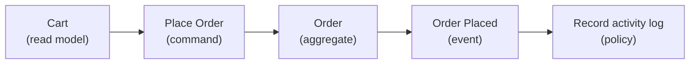

# Stormm — Project Overview

*As of 2026-09-21. Live, editable version: https://claude.ai/artifact/P2Fuau2A8p6FzFJpCnJcqi*

Stormm is a visual process-modeling canvas — inspired by Event Storming and Domain-Driven Design — where diagramming a business process also produces the domain model code behind it.

## Inspiration: Event Storming

Event Storming already shows a business process as a sequence of typed steps. Stormm reads that sequence directly as a domain model. The classic **Place Order** process:

The customer decides to order from their **Cart** (read model); **Place Order** is the command that acts on the **Order** aggregate; placing the order records an **Order Placed** event; a policy reacts to it ("whenever order placed, record activity log"). Along the way, an actor (Customer) and any open hotspot questions attach to the **Place Order** block as attributes, not as blocks of their own — see Canvas & interaction design below.

## From model to code

Code generation is part of Stormm's vision and roadmap — the exact mapping isn't finalized yet, but the direction is for each block type to map to a domain/code artifact along these lines:

| Block type | Domain / code artifact | Example (Go) |
| --- | --- | --- |
| Command | Application command struct | `PlaceOrder struct { CartID, CustomerID, ShippingAddress }` |
| Aggregate | Domain entity / aggregate root, with its own operation and an event stack | `Order.PlaceOrder()` records `OrderPlaced` |
| Event | Domain event appended to the aggregate's event stream | `OrderPlaced` |
| Aggregate (generated alongside) | Repository | persists/loads the `Order` aggregate |
| Policy | Reactive handler triggered by an event | "whenever Order Placed, record activity log" |
| External system | Something outside the domain that handles a command and reports back with an event | a payment gateway: `Charge Card` → `Card Charged` |

Modeling the process and generating the domain code would become the same act — no separate translation step from diagram to code, so the two never drift apart. That's the vision for cutting development time and keeping the code consistent; the exact implementation is still on the roadmap.

## Canvas & interaction design

- **Sidebar** lists Processes, one row per process the user is modeling.
- **Canvas** fills the rest of the window — the main work surface, kept as large as possible for interacting with the process model.
- **Block** is the unit of the canvas: draggable and connectable, one per command, aggregate, external system, event, policy, or read model.
- **Actor** (e.g. Customer) is never its own block — it's an attribute on the block it applies to.
- **Hotspot** is never its own block either — it's an attribute on the block it applies to.
